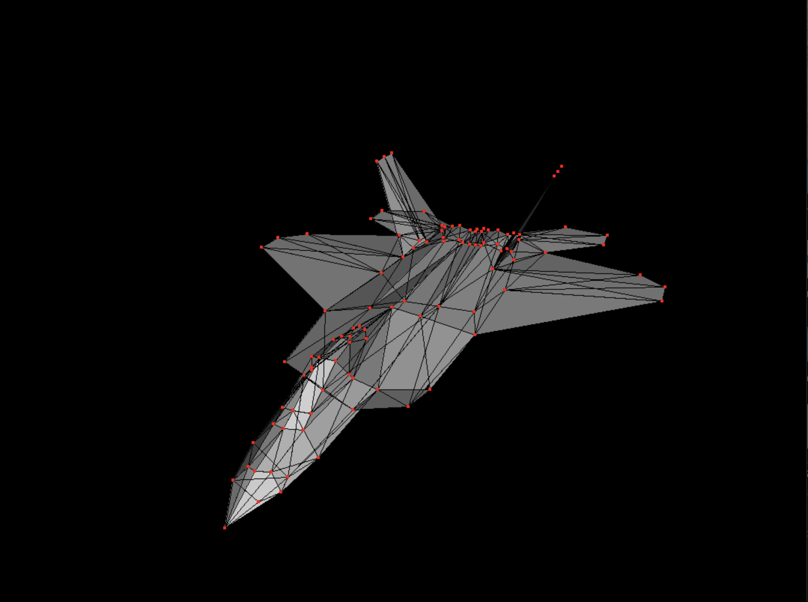
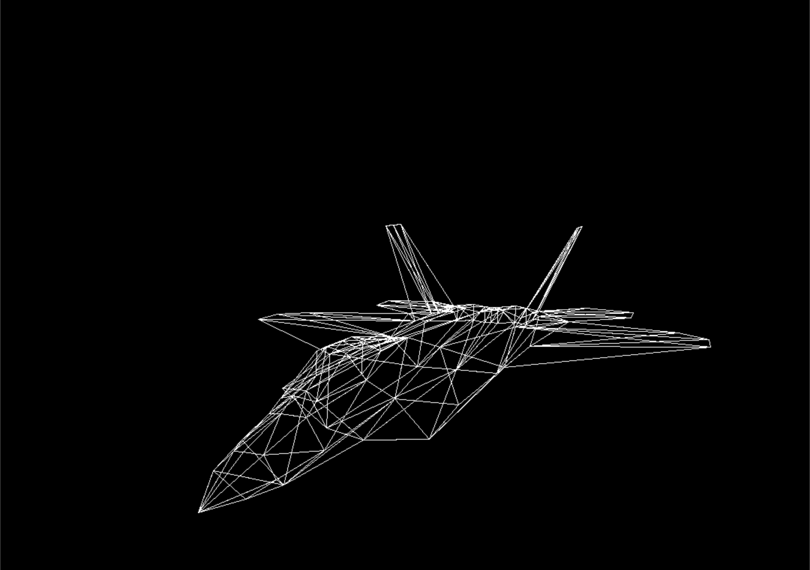
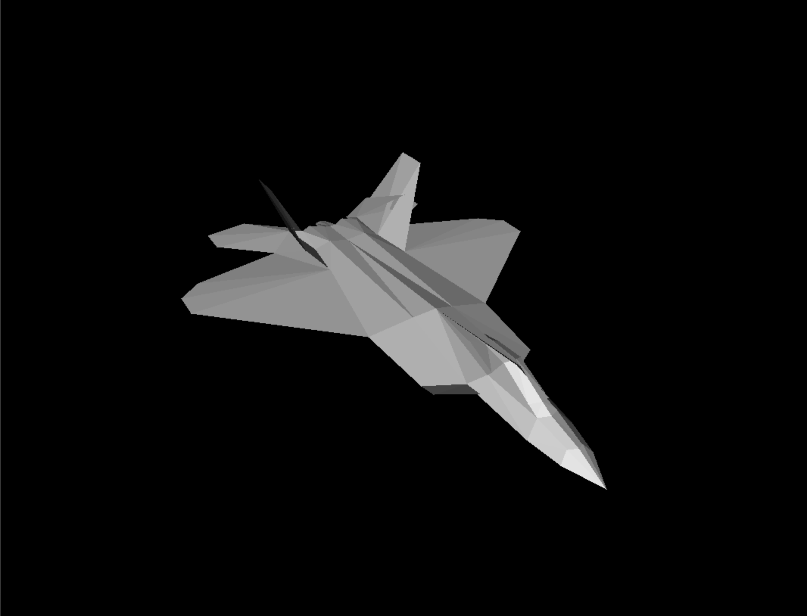

# 3D Engine (CPU Rasterizer)

A lightweight, 3D engine written in C (CPU rasterizer), using the Left-Handed Coordinate system.  
Focus: **clarity + performance** on the CPU — no OpenGL/DirectX required.

<p align="center">
  
  
  
</p>


## Features
- OBJ loader (verts/uvs/normals/faces)
- Draw modes: **Wireframe**, **Wireframe + vertices**, **Filled**, **Filled+wire**,
- Movable first-person camera
- Backface culling, near-plane clipping, simple depth sort
- Solid black background


## Quick Start

### Dependencies
- C99 compiler (clang/gcc)
- **SDL2**

**macOS (Homebrew)**
```bash
brew install sdl2
make            # or: clang -std=c99 -O2 src/*.c -lSDL2 -o 3d-engine
./3d-engine
